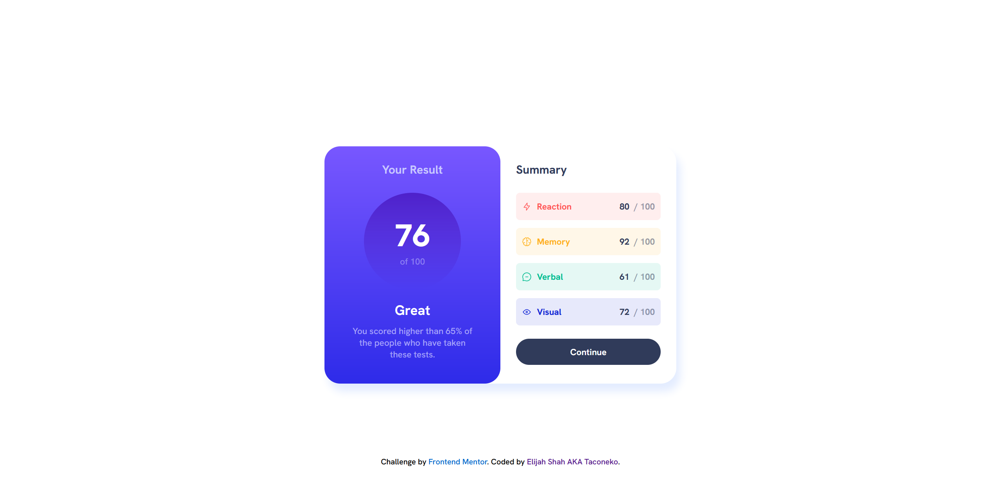
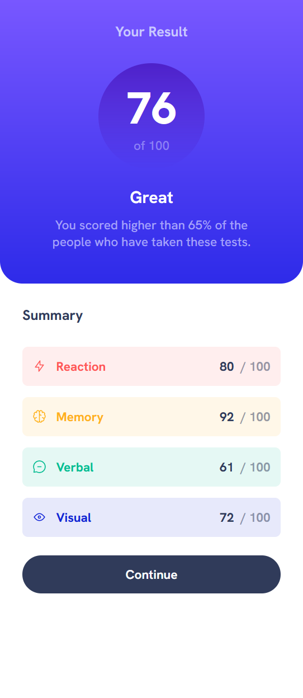

# Frontend Mentor - Results summary component solution

This is a solution to the [Results summary component challenge on Frontend Mentor](https://www.frontendmentor.io/challenges/results-summary-component-CE_K6s0maV). Frontend Mentor challenges help you improve your coding skills by building realistic projects. 

## Table of contents

- [Overview](#overview)
  - [The challenge](#the-challenge)
  - [Screenshot](#screenshot)
  - [Links](#links)
- [My process](#my-process)
  - [Built with](#built-with)
  - [What I learned](#what-i-learned)
  - [Continued development](#continued-development)
- [Author](#author)
- [Acknowledgments](#acknowledgments)

## Overview

This was a bit of a challenging project, I had trouble keeping things organised. I think I'm going to switch to Sass for future projects because nesting would've especially helped in keeping things readable.

### The challenge

Users should be able to:

- View the optimal layout for the interface depending on their device's screen size
- See hover and focus states for all interactive elements on the page

### Screenshot

### Links

- Solution URL: [Add solution URL here](https://your-solution-url.com)
- Live Site URL: [Add live site URL here](https://your-live-site-url.com)

## My process

This took me way longer to do than it should have. I got frustrated with it a lot, because I couldn't figure out how to do seemingly simple things. I got it in the end though, and I'm pretty proud of it.

Side note: I'm really upset that transitions don't work on gradients. I wanted to put a nice transition on the button for the hover/focus states, but it just wouldn't work. After some googling, I found out it's just not a thing you can do without unnecessarily complicating things. Kinda upsetting.

### Built with

- Semantic HTML5 markup
- CSS custom properties
- Flexbox
- CSS Grid
- A lot of frustration

### What I learned

I learnt a lot more about how to use CSS grid and flexbox effectively, and also about how to do media queries right. I'm still not sure on how I should set up my breakpoints... I'm just kinda going along and seeing what looks decent.

Oh, and I used the min() function correctly. That was cool. 

### Continued development

I'm going to start learning Sass, at the very least for the nesting. I'm pretty comfortable with writing vanilla CSS but it gets out of hand quick.

## Author

- Frontend Mentor - [@taco-neko](https://www.frontendmentor.io/profile/taco-neko)

## Acknowledgments

- Alana, for helping me figure out a bunch of noob stuff.
- Dirtblort gaming, for gaming
